Implementación de estrategias de control inteligente de tráfico urbano
=======================================================================

**Estudiante:** Giovanny González Baltazar

**Asesores:** Dr. Joel Antonio Trejo Sánchez y Dr. Mauricio Gabriel Orozco del Castillo

# Introducción
Más vale tarde que nunca. En los países en vías de desarrollo en innumerables ocaciones hemos tenido que afrontar problemas a los que otros países más "avanzados" ya se han enfrentado antes. Está de más decir que es malo estar retrasado en algo, pero definitivamente enfrentarte a un problema que otros ya han tenido antes representa una gran ventaja, pues contamos con una gran base de conocimientos y nuevas herramientas para resolver de manera innovadoras nuestros problemas particulares.

Uno de esos problemas es el tráfico urbano. Nuestras pequeñas urbes están en un proceso de imparable crecimiento que hace que día con día se asemejen cada vez más a las grandes metrópolis comunes en los países más desarrollados. No podemos detener la rueda, pero ya sabemos bien en que se convertirán y es una excelente oportunidad para aprovechar el conocimiento acumulado de otros lugares para hacer que el crecimiento de nuestras urbes sea lo más saludable posible.

Una cantidad significativa de la actividad en un area urbana tiene que ver con el movimiento de personas y bienes entre diferentes lugares usando la infraestructura de transporte, y un eficiente y fluido sistema de transporte es esencial para la salud económica y la calidad de vida dentro de las regiones urbanas.
(Patriksson, 1994, p. 3)

Conforme crecen las ciudades y se arraiga cada vez más la idea de la necesidad de tener trasporte personal, inevitablemente crece la demanda del sistema de transporte. Este aumento trae consigo problemas serios, como:
+ Mayor número de accidentes
+ Uso ineficiente del sistema de transporte debido a grandes congestiones.
+ Deterioro de la calidad de vida de las zonas adyacentes
+ Pollución
+ Contaminación sonora
(Patriksson, 1994)

# Abordaje del problema
El problema que se afrontará es el de las congestiones usando sistemas inteligentes de control de tráfico, o dicho de otra manera: *semáforos inteligentes*.

El objectivo es que los semáforos actuen similar a los típìcos oficiales de tránsito que a veces se encuentrar posicionados estratégicamente en las intersecciones más concurridas, pero con esteroides. Dichos policías observan la demanda de tráfico que ocurre en cada carril y en base a ello toman la decisión de a cuál dar el paso para mantener en todo momento un flujo de tráfico óptimo y acortar los tiempos de espera. El problema de usar personas para esta tarea; aparte del costo y la inviabilidad de hacerlo en cada insercción de una ciudad; es mantener el flujo constante, pues ¿de qué sirve que en una insersección un vehículo tenga la vía libre si al llegar a la seguiente no tendrá paso? Entonces el flujo se rompe y se genera una congestión que afecta todos los vehículos que lo suceden. Para solucionar este problema, pensamos que la clave es la coordinación entre los "oficiales de tránsito" y que estos formen una red en todos las intersecciones clave y tengan mentalidad de enjambre para que en todo momento cualquier oficial sepa cual es la cantidad y dirección del flujo de tráfico en cada una de las intersecciones de la red (o incluso en otras redes adyacentes) y en base a ello tome de decisiones en tiempo real que permitan un flujo de tráfico lo más eficiente posible, y que de pié a cosas tan útiles como dar paso completamente libre a ambulancias, patrullas y camiones de bomberos. Evidentemente esto no es tarea para un ser humano, pero si para un semáforo inteligente.

> Una de las principales respuestas al problema del control de tráfico urbano es
> reducir el tiempo de espera de los usuarios en la red de tráfico. Se puede reducir el tiempo
> de espera de los usuarios en la red de tráfico por medio del cambio dinámico de las señales
> desplegadas en los semáforos, y que este cambio se realice de acuerdo a la demanda de
> tráfico y a la coordinación con intersecciones adyacentes.
(Trejo, 2006)

La idea de un semáforo que se adapta a la demanda de tráfico no es nueva. Ya existen acercacimientos a esta idea, desde la más básica cambiando el ciclo de las luces dependiendo de la hora del día, hasta las mas complejas y costosas que usan inductores posicionados estratégicamente antes de llegar a las intersecciones para contabilizar cuantos vehículos están esperando en cada carril para que los semáforos usen esta información para, por ejemplo, no dar paso a un carril que no tiene ningún vehículo esperando.
El problema es que implementar la solución anterior es costoso, y aún así tiene mucho margen de mejora, pues la información que puede proporcionar un inductor se limita a si un vehículo pasa encima de el y la hora en la que sucede, lo que complica analizar el flujo real de cada uno de los vehículos. Por ello pretendemos darle uso a las cámaras que muchas veces ya se encuentran en las intersecciones y usar sus imágenes para alimentar algoritmos de machine learning de reconocimiento de objetos, y así saber cuantos, de que tipo y dirección de los vehículos. Ya que esta tarea tiene sus propia serie de retos y complicaciones, está siento realizada por otros colegas en el CIMAT. Lo que nos ocupa a nosotros es suponer que contamos con la información que este algoritmo nos brindará y en base a ello desarrollar las estrategias inteligentes de control a usar por los semáforos.

Para lograr el comportamiento buscado en los semáforos, primero:
+ Modelaremos los cambios entre las fases del semáforo usando Redes de Petri, donde cada transición entre ellas corresponderá un cambio de luz.
+ Una vez teniendo el modelo, diseñaremos de manera manual estrategias para algunos tipos de demanda: *poco tráfico*, *tráfico medio*, *mucho tráfico*.
+ En el punto anterior se puede notar que las cantidades de tráfico no son numéricas, si no que son cuantificadores relativos que una computadora no comprende tan fácilmente. Por ello implementaremos sistemas de control basados en lógica difusa que permitan que nuestros algoritmo principal sepa si hay "poco", "medio" o "mucho" tráfico.
+ Implementaremos lo anterior para que un semáforo en una intersección cambie a la estrategia correcta (creada por nosotros) según la semanda de tráfico detectada según la lógica difusa (poco, mucho, medio).
+ Entrenaremos a un algoritmo de machine learning para que según el histórico de tráfico de una intersección encuentre la estrategia óptima cambiando la configuración de la red petri que modela el cambio de luces.
+ Implementaremos lo anterior también en una sola intersección y probaremos su rendimiento en comparación con la simulación anterior (estática).
+ Crearemos un sistema para comunicar un semáforo con otro (probablemente también con algo similar a redes de petri).
+ Lo implementaremos en una simulación ahora con varias intersecciones y una red de semáforos.

# Herramientas: SUMO
Para lograr nuestro comentido, es necesario contar con un entorno de simulación versátil y altamente configurable donde probar los algoritmos creados en base a nuestras hipótesis. 
El primer acercamiento para resolver reste problema fue desarrollar desde cero un simulador de tráfico, pero ya que esto tiene su propia complejidad y no el objetivo final al que pretendemos llegar, buscamos otras alternativas. De entre todas, la que parece ser la solución definitiva es el simulador de tráfico urbano SUMO.
"**S**imulation of **U**rban **MO**bility" (Eclipse SUMO) es un paquete de
simulación de tráfico vial de código abierto, altamente portátil, microscópico y
continúo diseñado para manejar grandes redes viales. Permite simular cómo una
determinada demanda de tráfico que consiste en vehículos individuales se mueve a
través de una red de carreteras determinada. La simulación permite abordar un
amplio conjunto de temas de gestión del tráfico. Es puramente microscópico: cada
vehículo está modelado explícitamente, tiene una ruta propia y se mueve
individualmente a través de la red. Las simulaciones son deterministas por
defecto, pero hay varias opciones para introducir la aleatoriedad.

Al tratarse de un paquete, la instalación por defecto incluye varias
aplicaciones, scripts e interfaces aparte de SUMO. Estas aplicaciones se
utilizan para importar y preparar redes de carreteras, así como para procesar datos para su
uso en SUMO.

## Características relevantes de SUMO para la investigación de técnicas de control de semáforos.
-   Incluye todas las aplicaciones necesarias para preparar y realizar una
    simulación de tráfico
-   Permite simular desde una solo intersección hasta ciudades enteras
-   Altamente configurable a través de archivos XML
-   Documentación completa y actualizada de todas las características,
    interfaces y librerías que incluye, así como guías, tutoriales y ejemplos de
    configuración de gran cantidad tópicos.
-   Gran cantidad de tipos de vehículos disponibles, entre ellos de emergencia
    (ambulancias) y de autoridad (patrullas).
-   Calles de varios carriles con cambio de carril, carriles configurables para
    permitir solo el tipo de tráfico especificado.
-   Diferentes reglas de derecho de paso, semáforos
-   Incluye interfaces en Python para obtener datos de la simulación en tiempo
    real, así como para controlar aspectos de esta, como los semáforos.
-   Incluye editor gráfico de rutas y GUI para el simulador.
-   Velocidad de ejecución rápida (hasta 100.000 actualizaciones de vehículo por
    segundo en una máquina de 1 GHz)
-   Código abierto (EPL)

## Vista general
Editor gráfico NETEDIT mostrando una inserción y el menú de edición de semáforos.
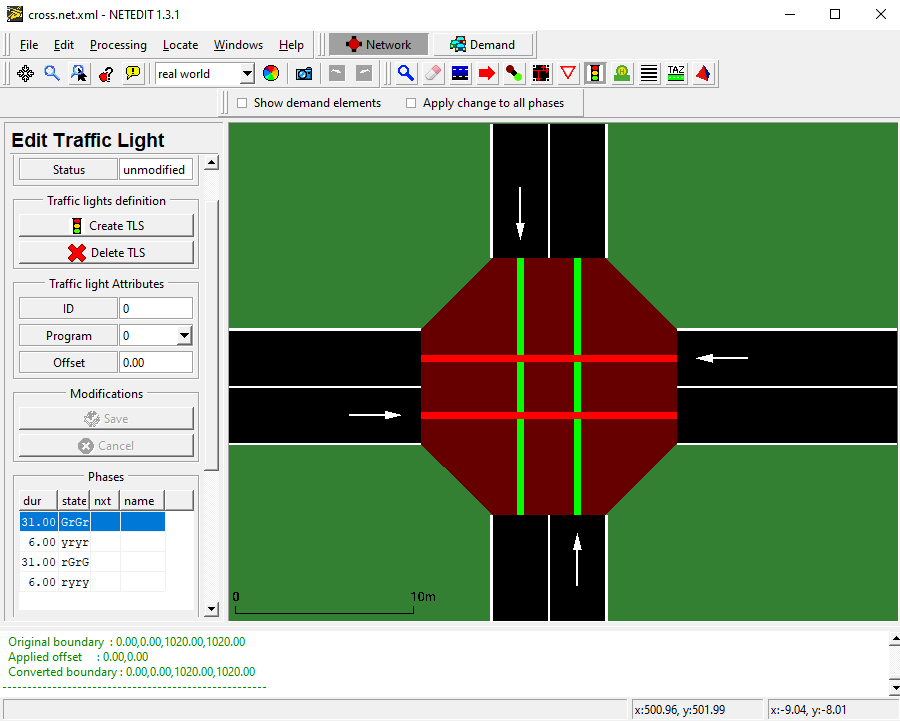

Simulando la intersección anterior de manera gráfica en SumoGui.
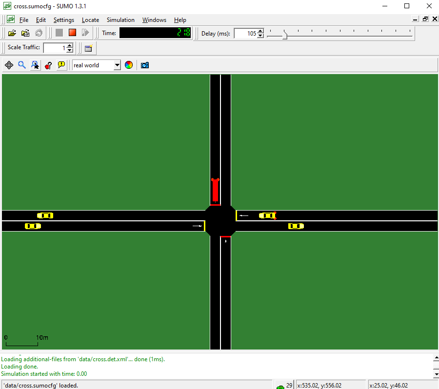

Controlando los semáforos desde Python con TraCI (Traffic Control Interface).
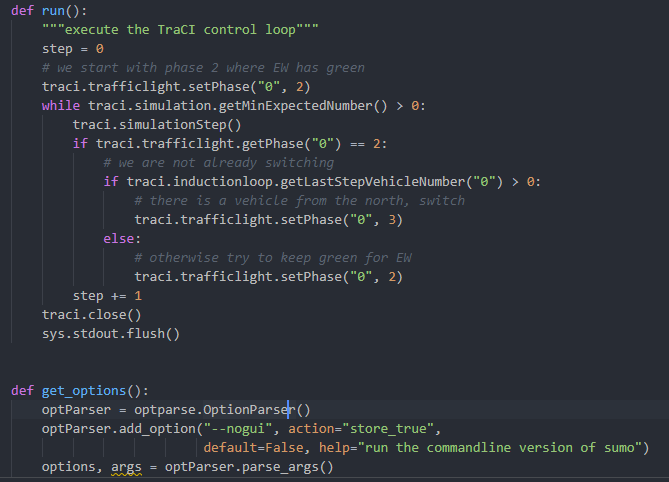

Los diversos tipos de vehículos disponibles.
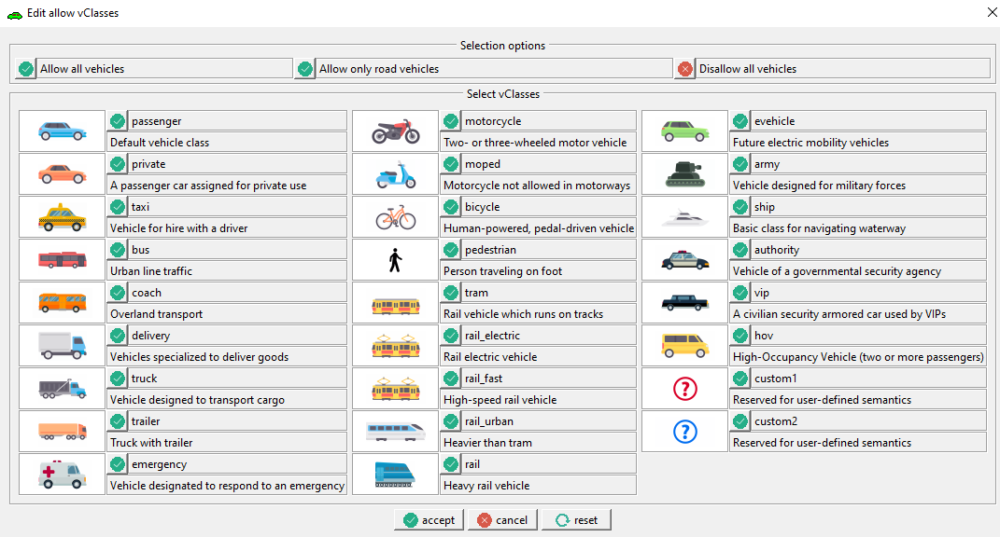

## Simulación de semáforos

Los semáforos (llamados en el simulador TLS - *Traffic Light System*) se pueden
crear de manera gráfica en NETDIT y automáticamente generan un programa de
control.

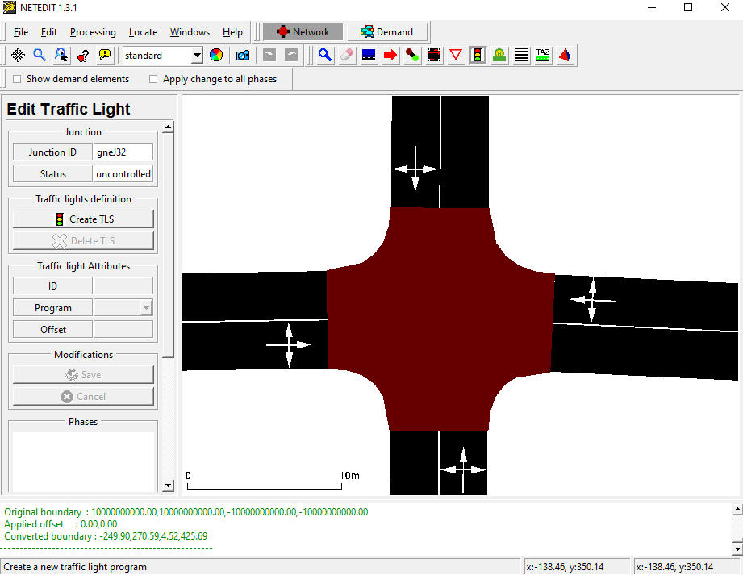

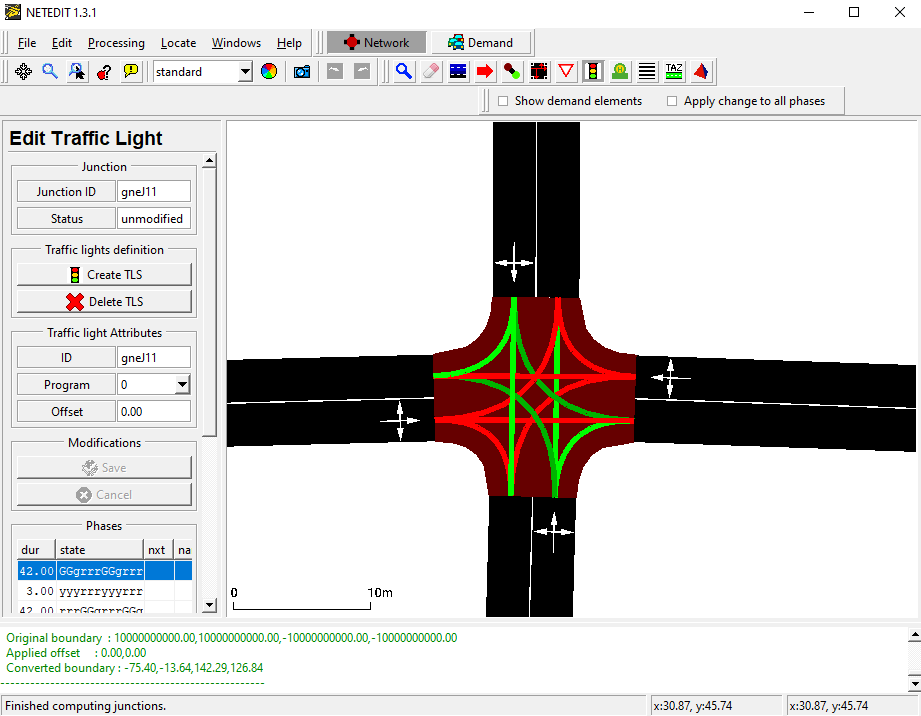


## Definición de nuevos programas TLS

Se puede cargar nuevas definiciones para semáforos como parte de un archivo
adicional. La definición de un programa de semáforo dentro de un archivo
adicional se ve así:

```xml
<additional>
    <tlLogic id="semaforo_principal" type="static" programID="principal" offset="0">
        <phase duration="40" state="GrGr"/>
        <phase duration="6" state="yryr"/>
        <phase duration="40" state="rGrG"/>
        <phase duration="6" state="ryry"/>
    </tlLogic>
</additional>
```
Cada programa está compuesto de varias fases de cierta duración. En cada una, el atributo *state* define con una cadena de caracteres los colores de todos los semáforos en esa fase. El significado de los caracteres principales se puede ver en la siguiente tabla:
| Caracter | Color    | Descripción                                                                                          |
|----------|----------|------------------------------------------------------------------------------------------------------|
| r        | rojo     | Luz roja: los vehículos deben detenerse.                                                             |
| y        | amarillo | Luz amarilla:los vehículos desacelerarán si están lejos de la insersección, de lo contrario pasarán. |
| G        | verde    | Luz verde de prioridad: los vehículos pasarán.

La posiciónde cada caracter en la cadena se corresponde con las conexiones de la insercción controlada empezando desde arriba en el orden de las manecillas del reloj. Por ejemplo, la siguiente imagen se corresponde con la cadena `state = "GrGr"`.
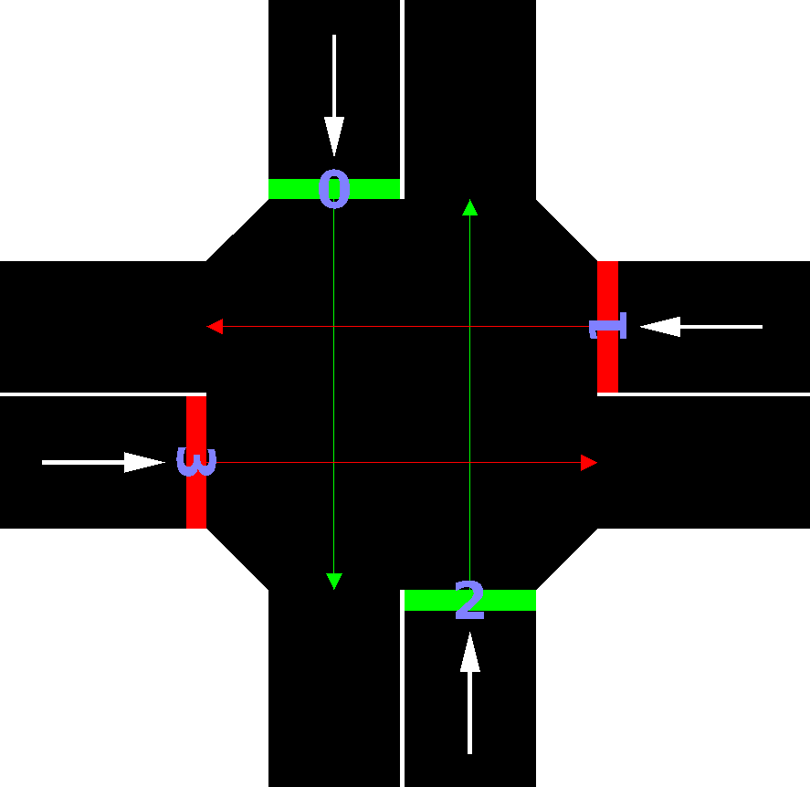

## Control de los semáforos con Python
Más importante aún, también es posible controlar los estados de los semáforos programáticamente a través de una interfaz incluida en el paquete de instalación llamada TraCI.

TraCI es la abreviatura de " **Tra**fic **C**ontrol **I**nterface". Al dar
acceso a una simulación de tráfico en ejecución, permite recuperar valores de
objetos simulados y manipular su comportamiento "en línea".

TraCI utiliza una arquitectura cliente / servidor basada en TCP para
proporcionar acceso a SUMO. De este modo, SUMO actúa como servidor y el código Python con TraCI como cliente.

A continuación, se muestra el código de ejemplo que controla la lógica del
semáforo para que se controle de la siguiente manera:

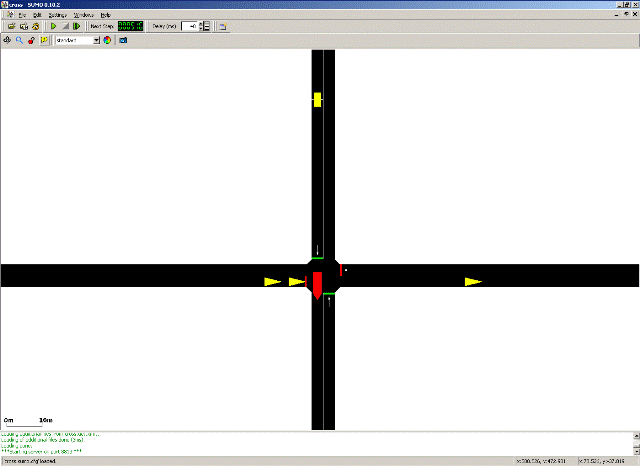

El ejemplo muestra una simple intersección de cuatro vías. Hay tráfico normal en
el eje horizontal y vehículos importantes (ambulancias, patrullas, camiones de
bomberos, etc.) en el eje vertical de norte a sur. En la vía que viene desde el
norte hay un detector para reconocer a los vehículos que van entrando. Mientras
que ningún vehículo ingresa desde el norte, siempre damos color verde en el eje
horizontal, pero cuando un vehículo ingresa al circuito del detector, cambiamos
la señal de inmediato para que el vehículo pueda cruzar la intersección sin
detenerse.

```python
step = 0
traci.trafficlight.setPhase("0", 2)
while traci.simulation.getMinExpectedNumber() > 0:
    traci.simulationStep()
    if traci.trafficlight.getPhase("0") == 2:
        if traci.inductionloop.getLastStepVehicleNumber("0") > 0:
            traci.trafficlight.setPhase("0", 3)
        else:
            traci.trafficlight.setPhase("0", 2)
    step += 1
traci.close()
```
# Herramientas: Redes de Petri
Las redes de petri se usarán para modelar el comportamiento de las intersecciones controladas por semáforos, que se comporta como un sistema discreto.
> Mientras que un sistema continuo es aquel que va cambiando al paso del tiempo de
> forma constante, un sistema discreto es aquel que cambia su estado en intervalos
> de tiempo variados y no de forma constante.
(Medina, Tuoh y Hernández)

La ventajas de usar una red de petri es que estas se pueden representar tanto gráficamente como matemáticamente a través de matrices de estado.

> Las Redes de Petri clásicas se conciben como un grafo dirigido que posee dos
> tipos de nodos principales: los lugares representados por círculos y las
> transiciones representadas por barras rectangulares (figura 2). Entre los nodos
> se ubican los arcos dirigidos, los cuales se encargan de unir las transiciones
> con los lugares y viceversa. Cada arco dirigido posee un número que indica su
> peso, el cual determina la cantidad de marcas que consume de un lugar o deposita
> en un lugar, siempre y cuando se haya disparado una transición habilitada. Los
> arcos dirigidos sin número se entiende que consumen o depositan una marca. Las
> marcas se representan en forma gráfica como puntos negros que se ubican dentro
> de cada lugar.

(Murillo, 2008)

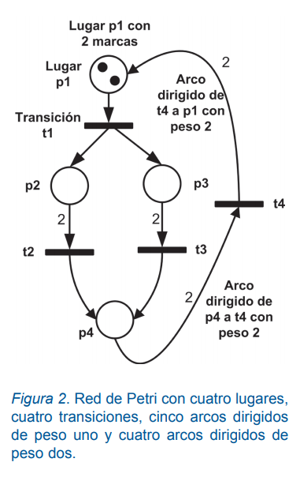

Ejemplo de red de forma gráfica
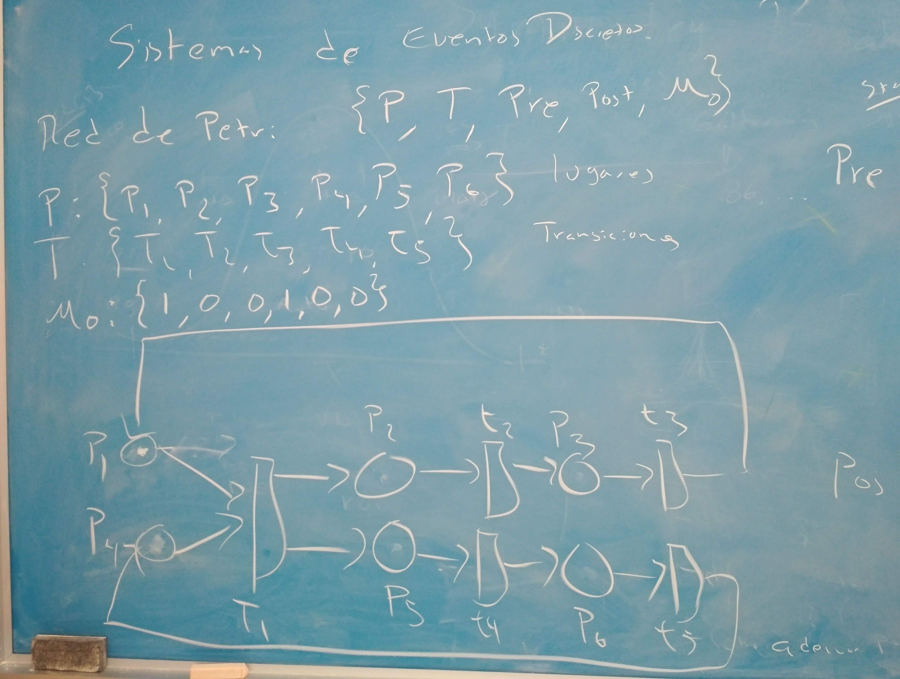
Ejemplo de la misma red, en matriz
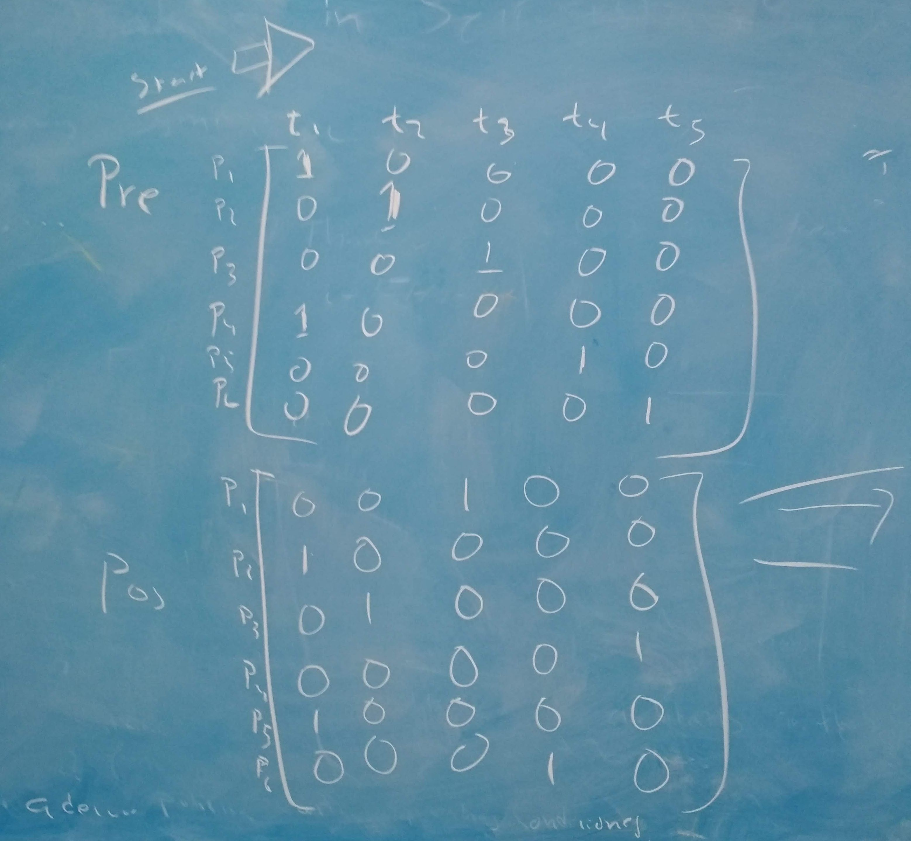

Para poder usar las redes de petri en conjunto con el simulador SUMO fue necesario desarrollar una pequeña librería en Python que facilite toda la lógica de control, pues no nos fue posible encontrar ninguna que cumpla con los requisitos que necesitamos.
Los requisitos son:
+ Permitir configurar cualquier estructura de red según sea necesario.
+ Poder anexar una acción programática a cada trancisión.
+ Que se pueda avanzar en la red de petri al mismo tiempo que con la simulación en SUMO.
+ Definir más de una marca en cada estado.

A continuación se muestra el código
```python
class Node:
    def __init__(self, name_initial, id):
        self.id = id
        self.nextNodes = []
        self.name_initial = name_initial
        if name_initial == 'transition':
            self.listExpectedType = Place
        elif name_initial == 'places':
            self.listExpectedType = Transition
        else:
            raise ValueError('Error!', 'No se configuro un tipo de nodo') 
    def getName(self):
        return "{}{}".format(self.name_initial, self.id)
    def print(self):
        print(self.getName(),'-> ', end='')
    def printNextNames(self):
        for node in self.nextNodes:
            print(node.getName())
    def addNext(self, node):
        if isinstance(node, self.listExpectedType):
            self.nextNodes.append(node)
        else:
            raise ValueError('Error de tipo de datos!', "No se puede agregar un {} a una lista que espera {}".format( node.__class__.__name__, self.listExpectedType.__name__) ) 

class Transition(Node):
    def __init__(self, id):
        Node.__init__(self, 'transition', id)
        self.preconditions = []
        self.wait_time = 15
        self.time_waited = 0
        self.action = self.doNothing # default action
    def runAction(self):
        print("Executing action for:", self.getName())
        self.action()
    def print(self, end_of_line = ''):
        print("{}[{}]".format(self.getName(), self.time_waited),'-> ', end=end_of_line)
    def doNothing(self):
        pass
class Place(Node):
    def __init__(self, id):
        Node.__init__(self, 'places', id)
        self.marks = 0
    def print(self):
        print("{}[{}]".format(self.getName(), self.marks),'-> ', end='')

class Network:
    def __init__(self, places_list, transitions_list, initial_state_list = [], max_width = False):
        self.places = places_list
        self.transitions = transitions_list
        self.configurePreconditions()
        self.setInitialState(initial_state_list)
        self.global_time = 0
        self.max_width = max_width # "ancho" de la red. Se refiere a el numero de elementos (lugares y transiciones) unicos que se pueden recorrer antes de repetirse
    def setInitialState(self, initial_state_list):
        if initial_state_list:
            if len(initial_state_list) == len(self.places):
                for i in range(len(self.places)):
                    self.places[i].marks = initial_state_list[i]
            else:
                raise ValueError('Error!', 'Error en el numero de elementos en initial_state_list: se esperaban {} elementos y se recibieron {}.'.format(len(self.places), len(initial_state_list))) 
    def configurePreconditions(self):
        for transition in self.transitions:
            for place in self.places:
                if transition in place.nextNodes:
                    transition.preconditions.append(place)
    def nextStep(self):
        self.global_time += 1
        for transition in self.transitions: #? Por cada transicion ...
            all_conditions_marked = True
            #? ... validando que se cumplan todas las precondiciones ...
            if transition.time_waited == 0: #? ... solo si no se esta en estado de espera de una transicion que ya cumplió sus precondiciones previamente
                #? Recorriendo todos Place para verficar que se cumplan las marcas (se puede hacer esto porque python asigna objetos por referencia)
                for precondition in transition.preconditions:
                    if precondition.marks == 0:
                        all_conditions_marked = False #! TODO: hacer que se puedan configurar multiples marcas
            if all_conditions_marked: #? Cuando se cumplen todas las condiciones para la transicion...
                if transition.time_waited == transition.wait_time: #? ... ver que se halla esperado el tiempo de espera de la transicion
                    print("(t={}) ".format(self.global_time), end='')
                    transition.runAction()
                    transition.time_waited = 0
                    #? Quitando las marcas de las precondiciones
                    for pre in transition.preconditions:
                        pre.marks = 0
                    #? y poniendoselas a los Place() siguientes
                    for pos in transition.nextNodes:
                        pos.marks = 1
                else:
                    transition.time_waited += 1
    def fastForward(self, number_of_steps):
        for _ in range(number_of_steps):
            self.nextStep()

    def print(self, firstElements = True):
        pointer = self.places[0]
        for _ in range(self.max_width if self.max_width else len(self.places) + len(self.transitions)):
            pointer.print()
            if firstElements:
                pointer = pointer.nextNodes[0]
            else:
                pointer = pointer.nextNodes[-1]
        print()
    def getMatrixPre(self, show=False, log=False):
        # Generando la matriz PRE (condiciones que tiene que cumplir cada transicion para efectuarse)
        # Debe quedar con las transiciones en el eje horizontal y los lugares en el eje vertical:
        #   t0 t1 t2
        # p0 1  0  0 
        # p1 0  1  0 
        # p2 1  0  1 
        # De momento se genera con los ejes inversos y recorre diferente al imprimirlo en pantalla
        pre = []
        for transition in self.transitions:
            pre_col = []
            for place in self.places:
                if transition in place.nextNodes:
                    pre_col.append(1)
                else:
                    pre_col.append(0)
            pre.append(pre_col)
            
        pre_np = np.asarray(pre).transpose()
        if log: np.savetxt("./logs/pre.csv", pre_np, delimiter=',')
        
        if show:
            print("PRE MATRIX:")
            for i in range(len(pre[0])):
                for j in range(len(pre)):
                    print(pre[j][i], end=' ')
                print()
    def getMatrixPos(self, show=False, log=False):
        # Generando la matriz POS (condiciones que se cumplen luego de una transicion)
        pos = []
        for transition in self.transitions:
            pos_col = []
            for place in self.places:
                if place in transition.nextNodes:
                    pos_col.append(1)
                else:
                    pos_col.append(0)
            pos.append(pos_col)
            
        pos_np = np.asarray(pos).transpose()
        if log: np.savetxt("./logs/pre.csv", pos_np, delimiter=',')
            
        if show:
            print("POS MATRIX:")
            for i in range(len(pos[0])):
                for j in range(len(pos)):
                    print(pos[j][i], end=' ')
                print()
        return pos_np

#? Regresa una lista de objetos Places() que tienen como ID el rango de numeros pasado como argumento
def generatePlaces(range_of_ids):
    _p = []
    for i in range_of_ids:
        _p.append(Place(i)) # se le pasa i como argumento, que sera la id del Place()
    return _p
#? Regresa una lista de objetos Transition() que tienen como ID el rango de numeros pasado como argumento
def generateTransitions(range_of_ids):
    _t = []
    for i in range_of_ids:
        _t.append(Transition(i)) # se le pasa i como argumento, que sera la id del Transition()
    return _t
#? Red para pruebas
def getDemoNetwork():
    # Generando una lista de objetos Places() (Lugares) en una lista llamada 'places'
    places = generatePlaces(range(6))
    # Repitiendo el mismo proceso para generar los objetos tipo Transition() en la lista 'transition'
    transition = generateTransitions(range(5))
    # Estableciendo las relaciones entre Places y Transitions
    places[0].addNext(transition[0]) 
    transition[0].addNext(places[1])
    places[1].addNext(transition[1])
    transition[1].addNext(places[2])
    places[2].addNext(transition[2])
    transition[2].addNext(places[0])
    #
    places[3].addNext(transition[0])
    transition[0].addNext(places[4])
    places[4].addNext(transition[3])
    transition[3].addNext(places[5])
    places[5].addNext(transition[4])
    transition[4].addNext(places[3])
    #
    initial_state = [1,0,0,1,0,0]
    return Network(places, transition, initial_state, 6)

if __name__ == "__main__":
    petri = getDemoNetwork()
    petri.getMatrixPre(show=True)
    petri.getMatrixPos(show=True)
    print("Acciones de las transiciones:")
    petri.fastForward(31)
    print()
    print("Estado final de la red:")
    petri.print()
    print()
```
Si la librería es ejecutada directamente, ejecuta su bloque main que contiene una pequeña demo armando la siguiente red de petri:

Y el resultado es el siguiente:
```
PRE MATRIX:
1 0 0 0 0 
0 1 0 0 0 
0 0 1 0 0 
1 0 0 0 0 
0 0 0 1 0 
0 0 0 0 1 
POS MATRIX:
0 0 1 0 0 
1 0 0 0 0
0 1 0 0 0
0 0 0 0 1
1 0 0 0 0
0 0 0 1 0
Acciones de las transiciones:
(t=16) Executing action for: transition0
(t=31) Executing action for: transition1
(t=31) Executing action for: transition3

Estado final de la red:
places0[0] -> transition0[0] -> places1[0] -> transition1[0] -> places2[1] -> transition2[1] ->
```
El código completo y su documentación se puede encontrar en el siguiente enlace: https://github.com/gggiovanny/sumo-petri-tls-control/

## Implementación
A continuación se muestra un ejemplo usando la interfaz TraCI y la librería de redes de petri para controlar el estado de un semáforo en SUMO:
```python
from config import traci
import config
import petri

def generatePetriNet():
    # Generando una lista de objetos Places() (Lugares) en una lista llamada 'places'
    places = petri.generatePlaces(range(4))
    # Repitiendo el mismo proceso para generar los objetos tipo Transition() en la lista 'transition'
    transition = petri.generateTransitions(range(4))
    # Estableciendo las relaciones entre Places y Transitions
    places[0].addNext(transition[0]) 
    transition[0].addNext(places[1])
    places[1].addNext(transition[1])
    transition[1].addNext(places[2])
    places[2].addNext(transition[2])
    transition[2].addNext(places[3])
    places[3].addNext(transition[3])
    transition[3].addNext(places[0])
    
    transition[1].wait_time = 30
    transition[2].wait_time = 6
    transition[3].wait_time = 35
    transition[0].wait_time = 6
    
    transition[0].action = lambda:traci.trafficlight.setRedYellowGreenState("semaforo_principal", "GrGr")
    transition[1].action = lambda:traci.trafficlight.setRedYellowGreenState("semaforo_principal", "yryr")
    transition[2].action = lambda:traci.trafficlight.setRedYellowGreenState("semaforo_principal", "rGrG")
    transition[3].action = lambda:traci.trafficlight.setRedYellowGreenState("semaforo_principal", "ryry")
    
    initial_state = [1,0,0,0]
    return petri.Network(places, transition, initial_state, 6)

def run(net):
    #? define la politica de control a usarse
    traci.trafficlight.setProgram("semaforo_principal", "manual")
    #* Ejecuta el bucle de control de TraCI
    while traci.simulation.getMinExpectedNumber() > 0:
        estado_anterior = traci.trafficlight.getRedYellowGreenState("semaforo_principal")
        traci.simulationStep()
        net.nextStep()
        estado_actual = traci.trafficlight.getRedYellowGreenState("semaforo_principal")
        if estado_actual != estado_anterior:
            print("Estado cambiado: {}->{}".format(estado_anterior, estado_actual))
        
    traci.close()

# este es el punto de entrada al script
if __name__ == "__main__":
    #? genera el archivo de configuracion que controla las rutas, tipos y flujo de los vehiculos
    config.generar_archivo_vehiculos()
    #? Generando la red de petri
    net = generatePetriNet()
    #? este es el modo normal de usar traci. sumo es iniciado como un subproceso y entonces el script de python se conecta y ejecuta
    traci.start(['sumo-gui', "-c", config.sumo_data_path+'demo.sumocfg'])
    #? ejecutando la funcion que controla a la simulacion
    run(net)
```
Y el resultado es el siguiente:
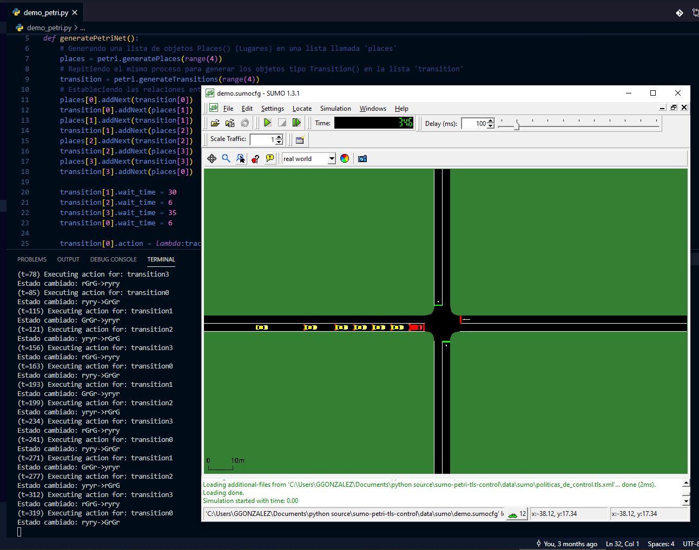
Se pueden observar los logs en cada cambio de estado en la red de petri, que controla el estado del semáforo.

# Referencias
Patriksson, M. (1994). The Traffic Assignment Problem: Models and Methods. 

Trejo Sánchez, Joel A.(2006). Control de tráfico urbano basado en sistemas multiagentes (Tesis de maestria). Centro de Investigación y de Estudios Avanzados del IPN Unidad Guadalajara, Guadalajara, Jalisco.

Murillo, Luis Diego. Redes de Petri: Modelado e implementación de algoritmos para autómatas programables
Tecnología en Marcha, Vol. 21, N.° 4, Octubre-Diciembre 2008, pp. 102-125. Recuperado de: https://dialnet.unirioja.es/descarga/articulo/4835618.pdf.

Medina Marín, Joselito & Tuoh Mora, Juan C. S. & Hernández R., Norberto. Aplicación de redes de petri en la modelación de sistemas de eventos discretos. Universidad Autónoma del Estado de Hidalgo. Recuperado de: https://www.uaeh.edu.mx/scige/boletin/icbi/n1/e4.html.